# Windows で Claude Code + Cursor + WSL2 をセットアップした記録

**対象環境:** Windows 11  
**目的:** XIAO ESP32C6 + DHT11 の Zigbee 開発環境を Cursor エディター上で構築する  
**作業日:** 2026年3月22日

---

## 目次

1. [Cursor エディターのインストール](#1-cursor-エディターのインストール)
2. [WSL2 のインストール](#2-wsl2-のインストール)
3. [Node.js のインストール](#3-nodejs-のインストール)
4. [Claude Code のインストール](#4-claude-code-のインストール)
5. [Claude Pro へのアップグレード](#5-claude-pro-へのアップグレード)
6. [Claude Code の初回起動・ログイン](#6-claude-code-の初回起動ログイン)
7. [Cursor と Claude Code の連携](#7-cursor-と-claude-code-の連携)
8. [まとめ・最終構成](#8-まとめ最終構成)

---

## 1. Cursor エディターのインストール

### インストール手順

1. [https://www.cursor.com/](https://www.cursor.com/) にアクセス
2. 「Download for Windows」をクリック
3. `CursorSetup.exe` を実行してインストール
4. 起動後、[cursor.com](https://cursor.com) でサインイン

### サインイン後の画面

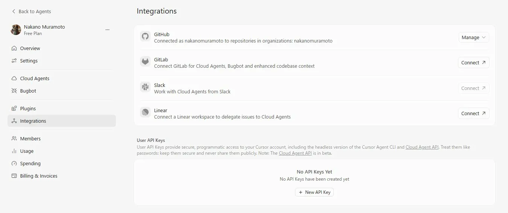

### Cursor アプリ起動画面

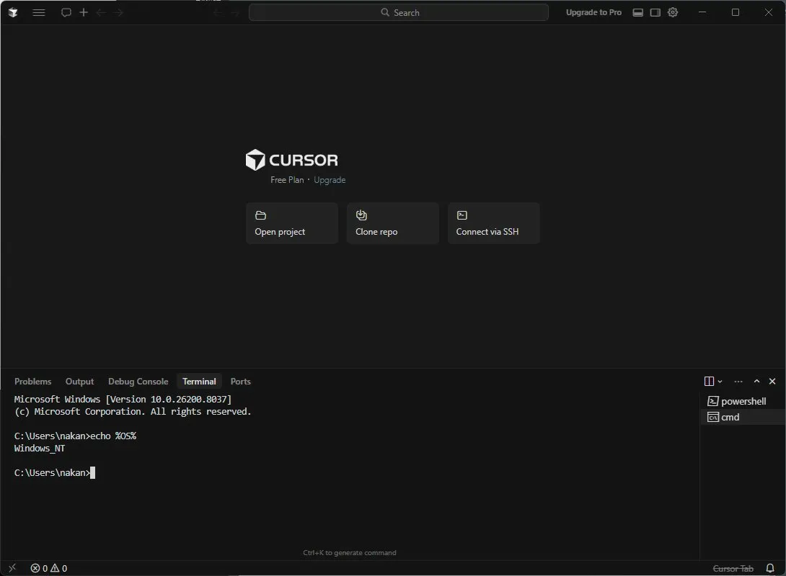

ターミナルで `echo %OS%` を実行し、`Windows_NT` が返ることを確認。

---

> ### ⚠️ やり直しゾーン：WSL のキャンセルについて
>
> Cursor 起動直後に以下のメッセージが表示された：
>
> ```
> 続行するには、Linux 用 Windows サブシステムを最新バージョンに更新する必要があります。
> 'wsl.exe --update' を実行して更新できます。
> 任意のキーを押して Linux 用 Windows サブシステムをインストールします。
> ```
>
> このとき **Ctrl+C でキャンセルしてしまった**が、実はこのメッセージは **Claude Code を使うために必要な WSL のインストール促進メッセージ**だった。
>
> Claude Code は Windows ネイティブ環境では動作しないため、WSL は**必須**。  
> このメッセージが出た時点でそのまま進めてしまって問題なかった。
>
> また、ターミナルのプロファイルを CMD に切り替える作業も行ったが、**最終的には WSL ターミナルを使うため不要だった**。

---

## 2. WSL2 のインストール

Claude Code は POSIX シェル環境が必要なため、WSL2 が必須。

### インストールコマンド

Cursor のターミナル（PowerShell）で実行：

```powershell
wsl --install
```

### インストール完了画面

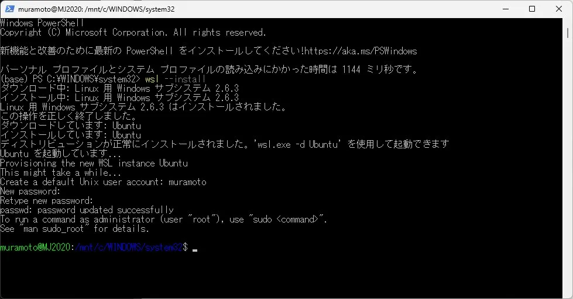

- WSL バージョン: **2.6.3**
- ディストリビューション: **Ubuntu**
- ユーザー名: `muramoto`
- パスワード設定完了

> **ポイント:** 今回は再起動なしでそのまま Ubuntu が起動した。通常は再起動が必要な場合もある。

---

## 3. Node.js のインストール

WSL（Ubuntu）ターミナル内で実行。

### インストールコマンド

```bash
curl -fsSL https://deb.nodesource.com/setup_lts.x | sudo -E bash -
sudo apt-get install -y nodejs
```

### バージョン確認

```bash
node --version
npm --version
```

**結果:**
```
v24.14.0
11.9.0
```

---

## 4. Claude Code のインストール

### インストールコマンド

最初に権限エラーが発生したため `sudo` を付けて実行：

---

> ### ⚠️ やり直しゾーン：権限エラー
>
> 最初に以下を実行したところエラーが発生：
>
> ```bash
> npm install -g @anthropic-ai/claude-code
> # → EACCES: permission denied エラー
> ```
>
> **この手順は不要。** 最初から `sudo` を付けて実行すればよかった。

---

### 正しいインストールコマンド

```bash
sudo npm install -g @anthropic-ai/claude-code
```

### バージョン確認

```bash
claude --version
# → 2.1.81 (Claude Code)
```

---

## 5. Claude Pro へのアップグレード

Claude Code の利用には有料プランまたは API キーが必要。

### ログイン方法の選択肢

| 選択肢 | 内容 |
|---|---|
| 1. Claude account with subscription | Pro ($20/月) / Max / Team / Enterprise |
| 2. Anthropic Console account | API 従量課金 |
| 3. 3rd-party platform | Amazon Bedrock など |

### アップグレード手順

1. [https://claude.ai](https://claude.ai) にアクセス
2. 「Upgrade to Pro」をクリック
3. 月額 $20 プランを選択（年間プランは 17% お得・後から変更可能）
4. クレジットカード情報を入力

### アップグレード完了画面


「Claude Code へのアクセスが可能になりました」と表示される。

> **補足:** 解約はいつでも `claude.ai → Settings → Billing → Cancel Plan` から可能。月額プランはキャンセル後もその月末まで利用できる。

---

## 6. Claude Code の初回起動・ログイン

### テーマ選択

```bash
claude
```

起動するとテーマ選択画面が表示される。

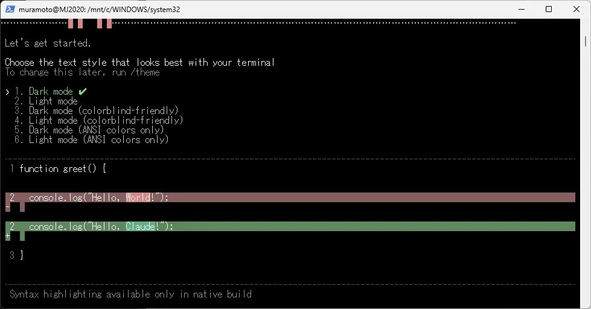

`1. Dark mode` を選択して Enter。

### ログイン画面

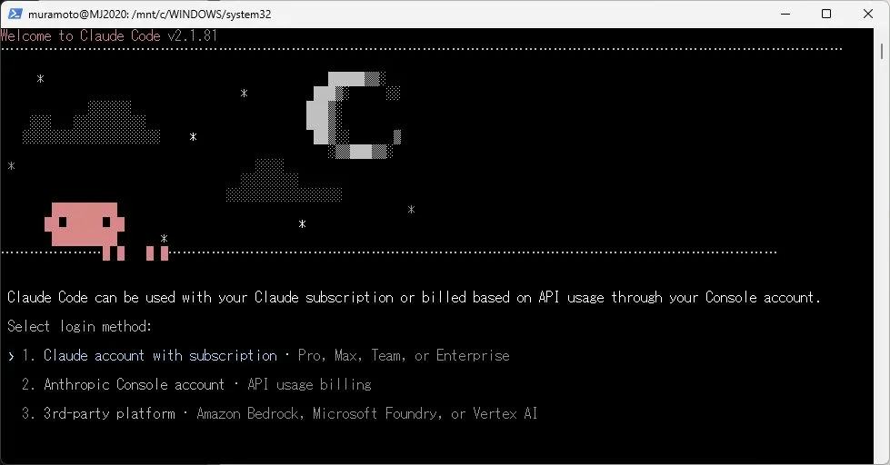

`1. Claude account with subscription` を選択して Enter。

### ブラウザ認証

---

> ### ⚠️ やり直しゾーン：ブラウザが自動で開かない
>
> 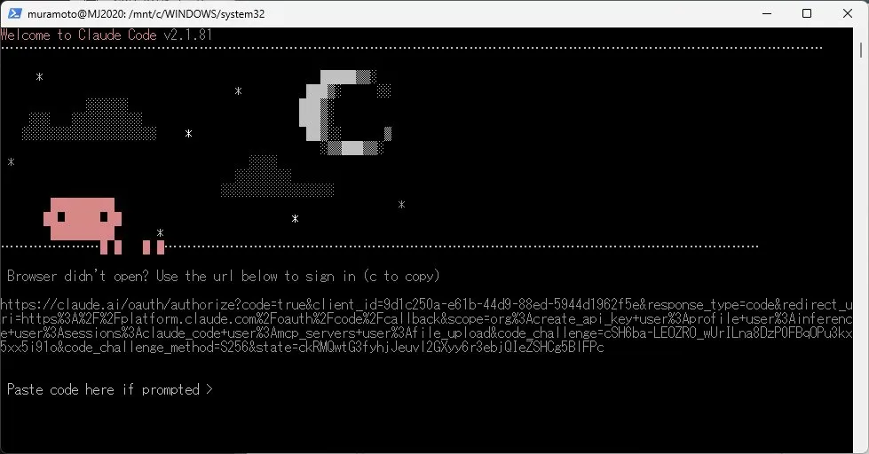
>
> WSL 環境ではブラウザが自動で開かないことがある。  
> この場合は **`c` キーを押して URL をコピー** → ブラウザに貼り付けて認証する。  
> 認証後に表示されるコードをターミナルの `Paste code here if prompted >` に貼り付ける。

---

### セキュリティ注意事項

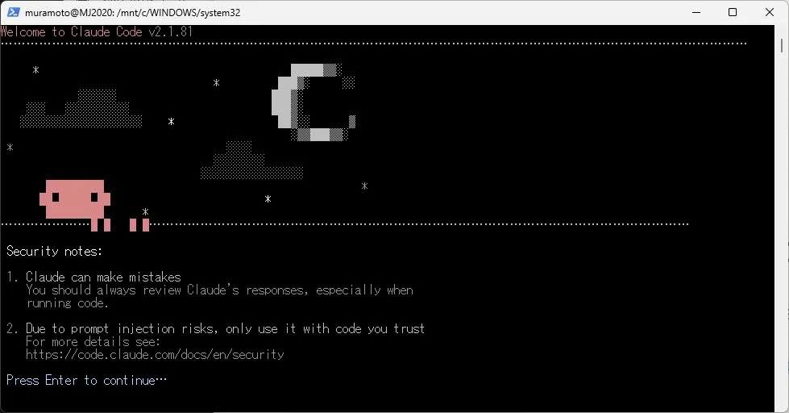

Enter で続行。

### 作業フォルダの信頼確認

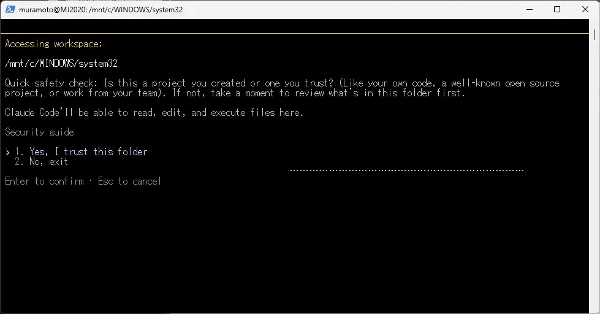

---

> ### ⚠️ やり直しゾーン：system32 フォルダで起動してしまった
>
> 最初は `/mnt/c/WINDOWS/system32` で Claude を起動してしまった。  
> これは Windows のシステムフォルダのため不適切。  
> `2. No, exit` で終了し、適切な作業フォルダに移動してから再起動した。

---

### 正しい作業フォルダで起動

```bash
cd /mnt/e
mkdir work
cd work
claude
```

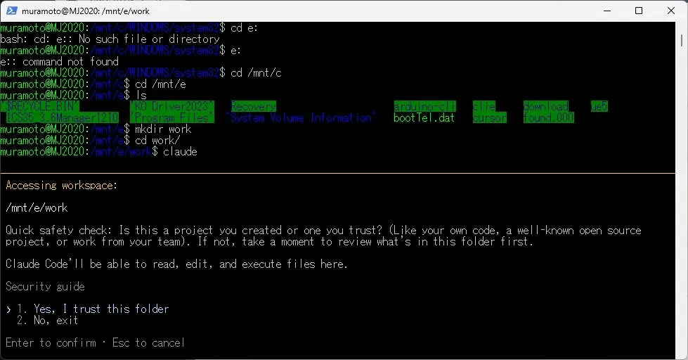

`/mnt/e/work` で `1. Yes, I trust this folder` を選択。

### 起動成功

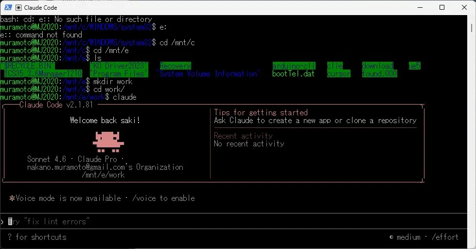

**Welcome back saki!** と表示され、正常に起動。

### 動作確認

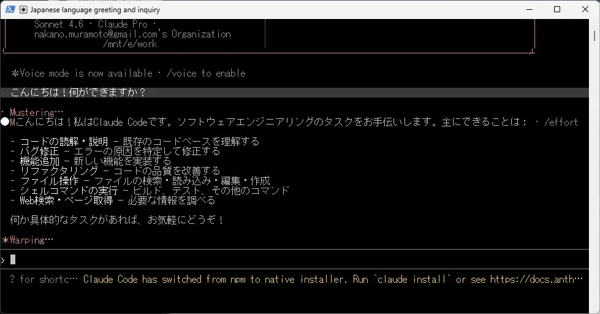

日本語で話しかけると日本語で応答することを確認。

---

## 7. Cursor と Claude Code の連携

### Cursor に Claude Code 拡張機能をインストール

`Ctrl+Shift+X` で拡張機能を開き、`Claude Code` で検索。

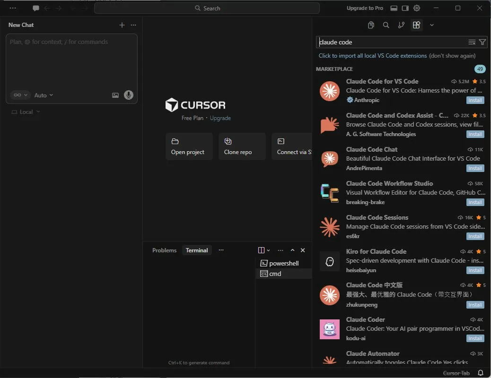

**「Claude Code for VS Code」**（Anthropic 製・5.2M DL）をインストール。

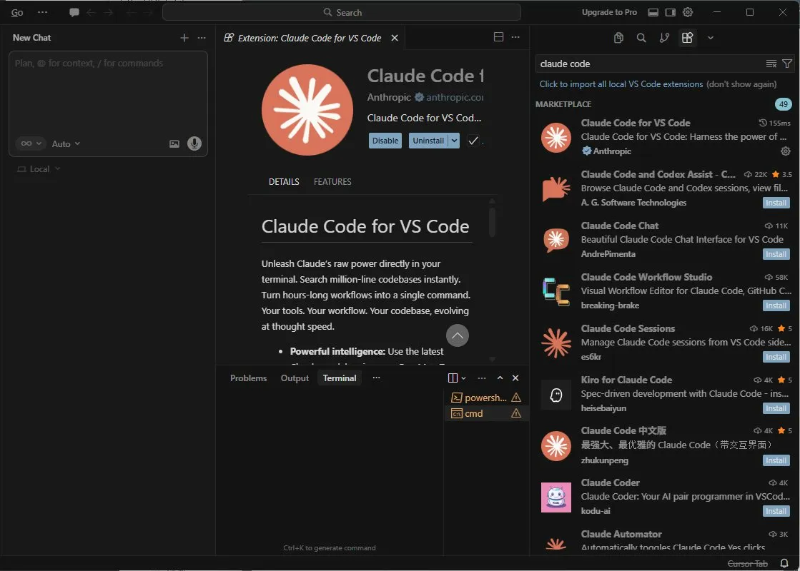

### WSL 拡張機能のインストール

ターミナルに WSL を追加。

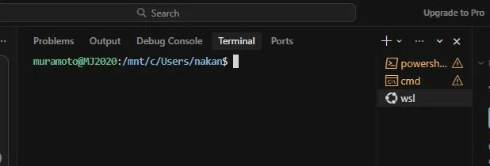

右下の通知から WSL 拡張機能をインストール。

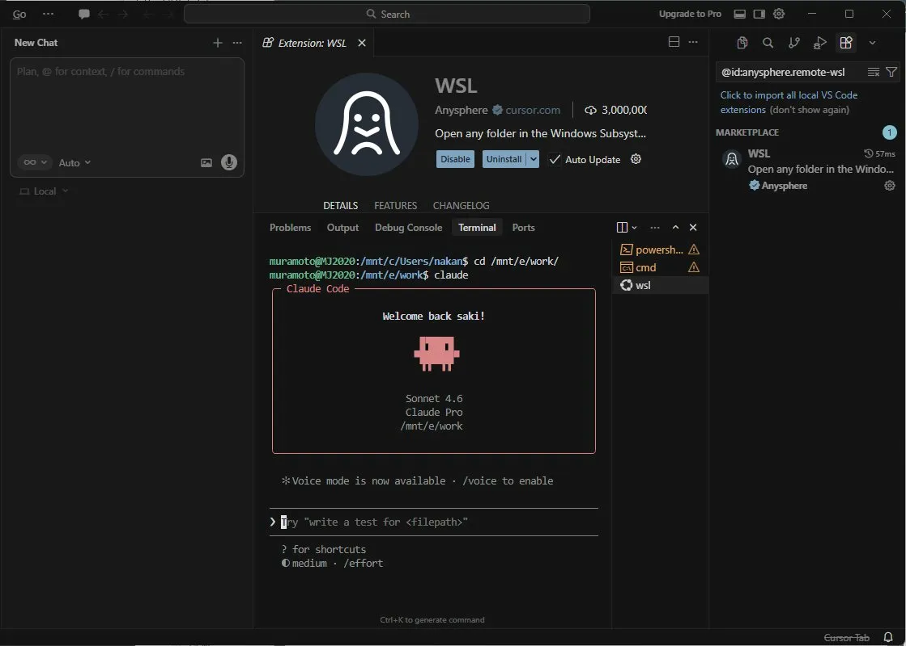

### WSL フォルダを Cursor で開く

`Ctrl+Shift+P` → `WSL: Open Folder in WSL` → `E:\work` を入力。

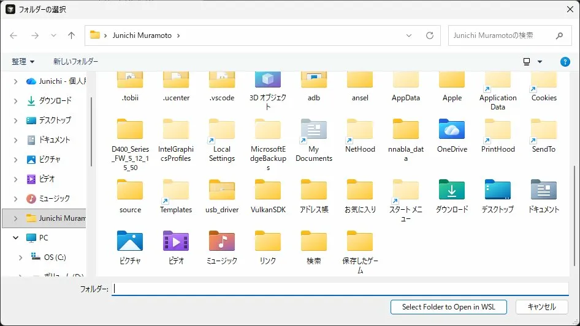

タイトルバーが **「work [WSL: Ubuntu]」** になれば成功。

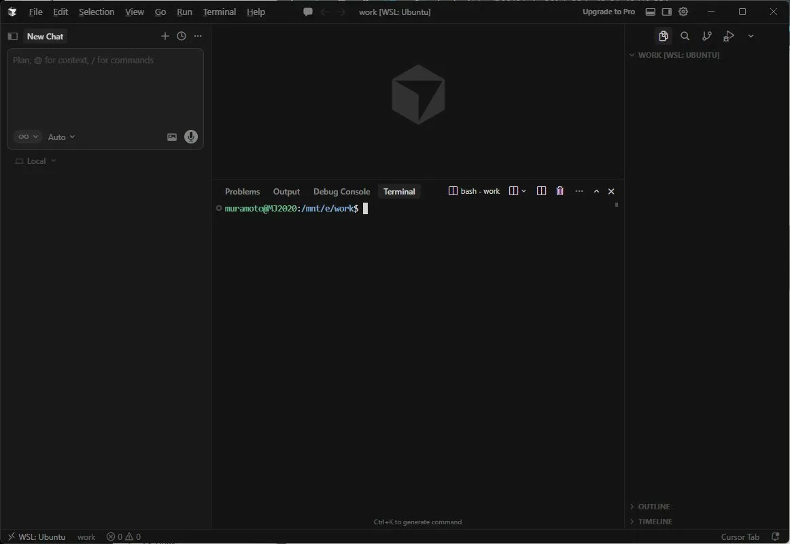

---

> ### ⚠️ やり直しゾーン：/ide で IDE が検出されない
>
> 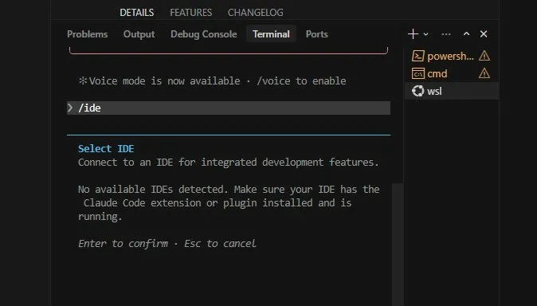
> 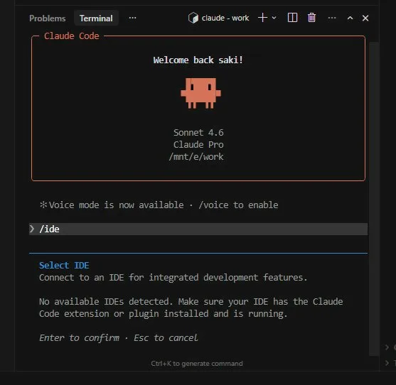
>
> Claude Code から `/ide` を実行しても「No available IDEs detected」が表示された。  
> **原因:** Cursor をフォルダなしで起動していたため拡張機能がアクティブにならなかった。  
> **解決策:** Cursor を完全再起動し、WSL モードでフォルダを開いてから再試行する。

---

### IDE 接続成功

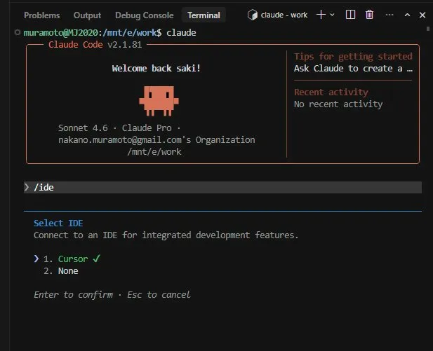

`/ide` を実行すると **「1. Cursor ✓」** が表示される。

Enter を押すと：

```
Connected to Cursor.
```

✅ **Cursor と Claude Code の連携完了！**

---

## 8. まとめ・最終構成

### 完成した環境

```
Windows 11
└── Cursor エディター（Windows上で動作）[WSL: Ubuntu]
    ├── 左パネル: Cursor AI チャット（Agent）
    ├── 右パネル: エディター
    └── ターミナル（WSL Ubuntu）
        └── Claude Code 2.1.81（/mnt/e/work で動作）
            └── Connected to Cursor ✓
```

### インストールしたもの

| ソフトウェア | バージョン | 備考 |
|---|---|---|
| Cursor | 最新版 | Windows ネイティブ |
| WSL2 | 2.6.3 | Ubuntu |
| Node.js | v24.14.0 | WSL 内 |
| npm | 11.9.0 | WSL 内 |
| Claude Code | 2.1.81 | WSL 内、sudo でインストール |
| Claude Code for VS Code | 最新版 | Cursor 拡張機能 |
| WSL 拡張機能 | 最新版 | Cursor 拡張機能 |

### 料金

- **Claude Pro: $20/月**（月払い、いつでも解約可能）

### 反省点・次やるなら

1. 最初の WSL インストール促進メッセージはキャンセルせずそのまま進める
2. ターミナルプロファイルの CMD 切り替えは不要
3. `sudo npm install` で最初からインストール
4. Cursor は最初から WSL モードでフォルダを開いておく
5. 作業フォルダは事前に用意しておく（`/mnt/e/work` など）

---

## 次のステップ

- [ ] ① Arduino CLI をインストールする
- [ ] ② ESP32 ボードパッケージを追加する
- [ ] ③ DHT11 ライブラリをインストールする
- [ ] ④ プロジェクトフォルダを作成する
- [ ] ⑤ コードを生成・確認する
- [ ] ⑥ コンパイル＆書き込みする

---

*作成: Claude Code + Claude (Anthropic)*

---

## 参考動画

- [CursorエディターでClaude Codeを動かす](https://youtu.be/WxiSVc7muVM?si=mRzUa5MiKB8gq7SF)
